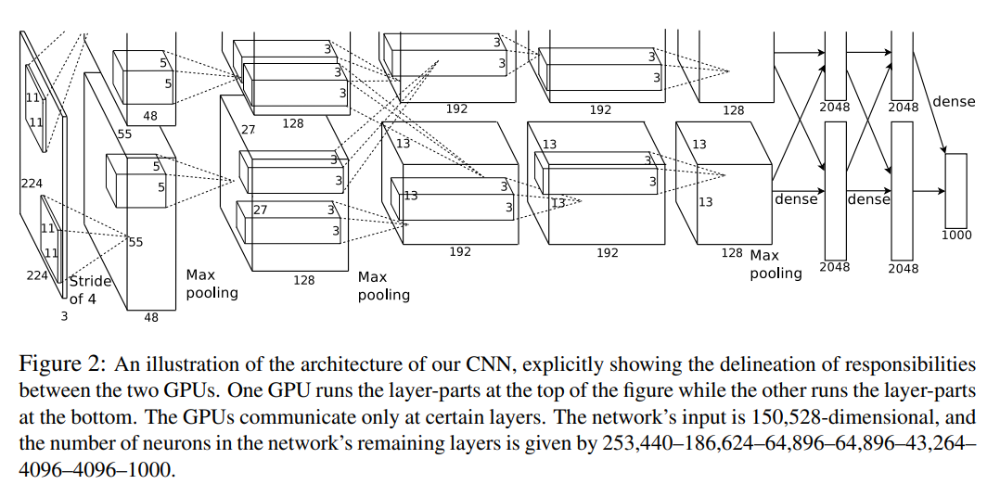
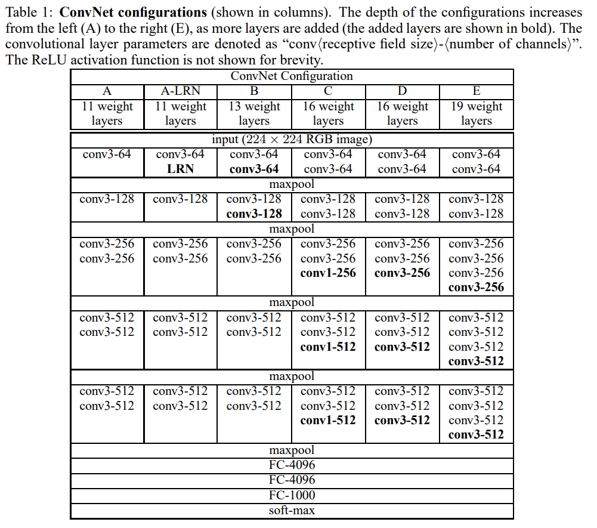

# CNN Study

Study and implementation of CNN architectures (LeNet, AlexNet, VGG, ResNet, MobileNet, EfficientNet) with PyTorch, along with structured experiments and performance comparisons.

## LeNet-5

- Paper: [Gradient-Based Learning Applied to Document Recognition](http://yann.lecun.com/exdb/publis/pdf/lecun-98.pdf)
- Authors: Yann LeCunn, Leon Bottou, Yoshua Bengio, and Patrick Haffner

- One of the earliest successful Convolutional Neural Network (CNN) architectures

- Motivation:
  - Fully connected networks are inefficient for image data (too many parameters)
  - Exploits spatial structure of images

- Key Ideas:
  - Local receptive fields
  - Weight sharing (reduces parameters)

- Significance:
  - Demonstrated strong performance on handwritten digit recognition (MNIST)
  - Foundation of modern CNN architectures

- Impelmentation: [cnn_study.models.lenet.LeNet5](./src/cnn_study/models/lenet.py)

  > The implementation is slightly adapted to a more modern architecture.
  > 
  > - S2 -> C3 feature map fully connected
  > - Trainable Pooling => Fixed Pooling
  > - tanh activation => ReLU activation
  > - Optional batch normalization

## AlexNet

- Paper: [ImageNet Classification with Deep Convolutional Neural Networks](https://proceedings.neurips.cc/paper_files/paper/2012/file/c399862d3b9d6b76c8436e924a68c45b-Paper.pdf)
- Authors: Alex Krizhevsky, Ilya Sutskever, and Geoffrey E. Hinton

- Winner of ILSVRC-2012 (ImageNet classification)
- Demonstrated that deep CNNs can achieve strong performance on large-scale datasets

- Key contributions:
  - ReLU activation (faster training than tanh/sigmoid)
  - Model parallelism across two GPUs (split network with limited cross-connections)
  - Local Response Normalization (LRN)
    - Normalizes across nearby feature channels
    - Encourages competition between neurons
  - Overlapping pooling (kernel size > stride)
  - Extensive data augmentation:
    - Random cropping / translation
    - Horizontal reflection
    - PCA-based RGB color augmentation
  - Dropout in fully connected layers to reduce overfitting

- Architectural characteristics:
  - Large convolution kernel and stride in early layers (11x11, stride 4)
  - Large fully connected layers (dominant parameter count)

- Implementation: [cnn_study.models.alexnet.AlexNet](./src/cnn_study/models/alexnet.py)
  > The implementation is slightly adapted to a more modern architecture.
  > 
  > - Full connected CNN connection(for single GPU)
  > - Remove LRN(instead use optional batch normalization)

## VGG

- Paper: [Very Deep Convolutional Networks for Large-Scale Image Recognition](https://arxiv.org/pdf/1409.1556)
- Authors: Karen Simonyan & Andrew Zisserman

- ILSVRC-2014 first and second places in localisation and classification trakcs respectively

- Demonstrated that increasing network depth improves classification performance

- Used a simple and uniform architecture:
  - 3×3 convolutions (stride=1, padding=1)
  - 2×2 max pooling

- Showed that stacking small convolutions is more effective than using large kernels:
  - Three 3×3 convolutions ≈ one 7×7 receptive field
  - Fewer parameters
  - More nonlinearities

- Explored 1×1 convolutions as additional nonlinear transformations

- Showed no improvement by using LRN introduced from AlexNet

- Introduced multi-scale training(kind of augmentation) and advanced test-time evaluation:
  - Dense evaluation
  - Multi-crop evaluation
  - Multi-crop & dense evaluation

- Large fully connected classifier remained a major portion of model parameters

- Later architectures (e.g. ResNet) addressed optimization difficulties when scaling to much deeper networks

- Implementation: [cnn_study.models.vgg.VGG16/VGG19](./src/cnn_study/models/vgg.py)