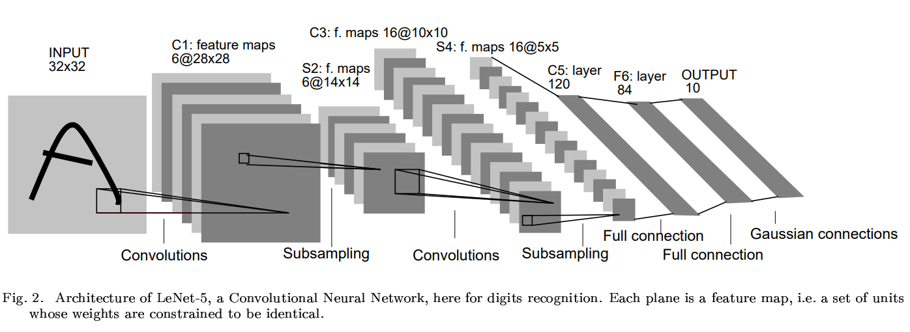

# CNN Study

Study and implementation of CNN architectures (LeNet, AlexNet, VGG, ResNet, MobileNet, EfficientNet) with PyTorch, along with structured experiments and performance comparisons.

## LeNet

- Paper: [Gradient-Based Learning Applied to Document Recognition](http://yann.lecun.com/exdb/publis/pdf/lecun-98.pdf)
- Authors: Yann LeCunn, Leon Bottou, Yoshua Bengio, and Patrick Haffner

- One of the earliest successful Convolutional Neural Network (CNN) architectures

- Motivation:
  - Fully connected networks are inefficient for image data (too many parameters)
  - Exploits spatial structure of images

- Key Ideas:
  - Local receptive fields
  - Weight sharing (reduces parameters)

- Significance:
  - Demonstrated strong performance on handwritten digit recognition (MNIST)
  - Foundation of modern CNN architectures

> The implementation is slightly adapted to a more modern architecture.
> 
> - S2 -> C3 feature map fully connected 로
> - Trainable Pooling => Fixed Pooling
> - tanh activation => ReLU activation
> - Optional batch normalization