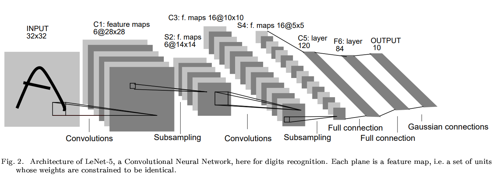
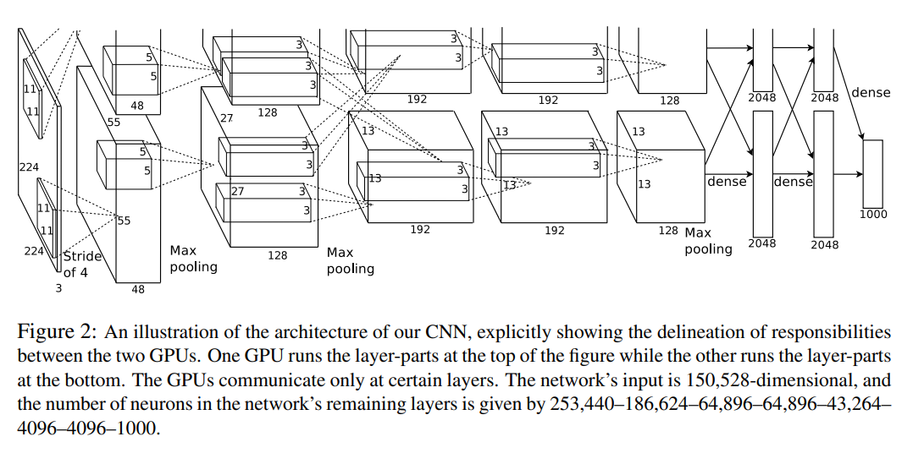
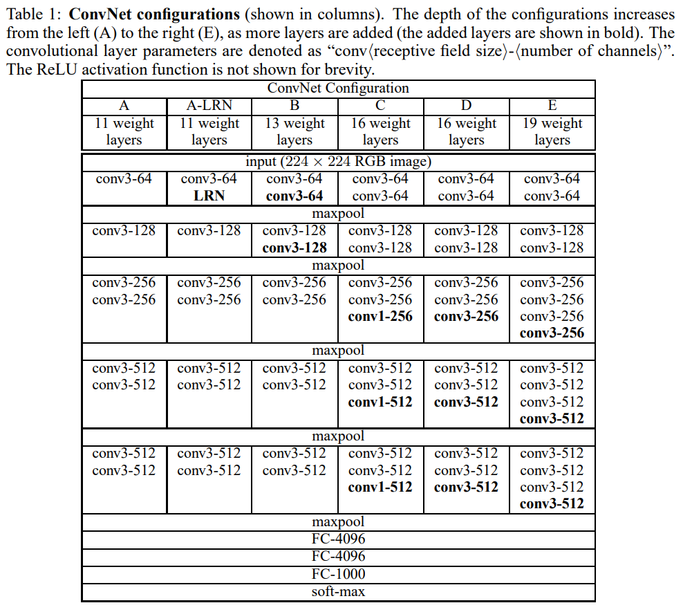
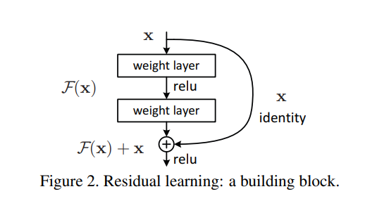
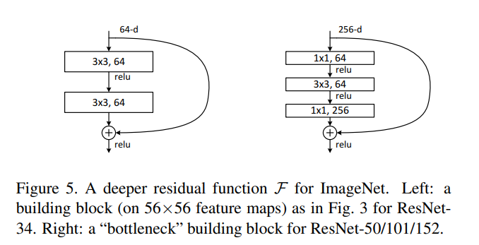

# CNN Study

Study and implementation of CNN architectures (LeNet, AlexNet, VGG, ResNet, MobileNet, EfficientNet) with PyTorch, along with structured experiments and performance comparisons.

## LeNet-5

- Paper: [Gradient-Based Learning Applied to Document Recognition](http://yann.lecun.com/exdb/publis/pdf/lecun-98.pdf)
- Authors: Yann LeCunn, Leon Bottou, Yoshua Bengio, and Patrick Haffner

- One of the earliest successful Convolutional Neural Network (CNN) architectures

- Motivation:
  - Fully connected networks are inefficient for image data (too many parameters)
  - Exploits spatial structure of images

- Key Ideas:
  - Local receptive fields
  - Weight sharing (reduces parameters)

- Significance:
  - Demonstrated strong performance on handwritten digit recognition (MNIST)
  - Foundation of modern CNN architectures

- Impelmentation: [cnn_study.models.lenet.LeNet5](./src/cnn_study/models/lenet.py)

  > The implementation is slightly adapted to a more modern architecture.
  > 
  > - S2 -> C3 feature map fully connected
  > - Trainable Pooling => Fixed Pooling
  > - tanh activation => ReLU activation
  > - Optional batch normalization

## AlexNet

- Paper: [ImageNet Classification with Deep Convolutional Neural Networks](https://proceedings.neurips.cc/paper_files/paper/2012/file/c399862d3b9d6b76c8436e924a68c45b-Paper.pdf)
- Authors: Alex Krizhevsky, Ilya Sutskever, and Geoffrey E. Hinton

- Winner of ILSVRC-2012 (ImageNet classification)
- Demonstrated that deep CNNs can achieve strong performance on large-scale datasets

- Key contributions:
  - ReLU activation (faster training than tanh/sigmoid)
  - Model parallelism across two GPUs (split network with limited cross-connections)
  - Local Response Normalization (LRN)
    - Normalizes across nearby feature channels
    - Encourages competition between neurons
  - Overlapping pooling (kernel size > stride)
  - Extensive data augmentation:
    - Random cropping / translation
    - Horizontal reflection
    - PCA-based RGB color augmentation
  - Dropout in fully connected layers to reduce overfitting

- Architectural characteristics:
  - Large convolution kernel and stride in early layers (11x11, stride 4)
  - Large fully connected layers (dominant parameter count)

- Implementation: [cnn_study.models.alexnet.AlexNet](./src/cnn_study/models/alexnet.py)
  > The implementation is slightly adapted to a more modern architecture.
  > 
  > - Full connected CNN connection(for single GPU)
  > - Remove LRN(instead use optional batch normalization)

## VGG

- Paper: [Very Deep Convolutional Networks for Large-Scale Image Recognition](https://arxiv.org/pdf/1409.1556)
- Authors: Karen Simonyan & Andrew Zisserman

- ILSVRC-2014 first and second places in localisation and classification trakcs respectively

- Demonstrated that increasing network depth improves classification performance

- Used a simple and uniform architecture:
  - 3×3 convolutions (stride=1, padding=1)
  - 2×2 max pooling

- Showed that stacking small convolutions is more effective than using large kernels:
  - Three 3×3 convolutions ≈ one 7×7 receptive field
  - Fewer parameters
  - More nonlinearities

- Explored 1×1 convolutions as additional nonlinear transformations

- Showed no improvement by using LRN introduced from AlexNet

- Introduced multi-scale training(kind of augmentation) and advanced test-time evaluation:
  - Dense evaluation
  - Multi-crop evaluation
  - Multi-crop & dense evaluation

- Large fully connected classifier remained a major portion of model parameters

- Later architectures (e.g. ResNet) addressed optimization difficulties when scaling to much deeper networks

- Implementation: [cnn_study.models.vgg.VGG16/VGG19](./src/cnn_study/models/vgg.py)

## ResNet

- Paper: [Deep Residual Learning for Image Recognition](https://arxiv.org/pdf/1512.03385)
- Authors: Kaiming He, Xiangyu Zhang, Shaoqing Ren, Jian Sun

- Winner of ILSVRC-2015 classification, detection, and localization tasks
- Winner of COCO-2015 detection and segmentation tasks

- Residual Learning 으로 Layer 가 깊어질 때 Optimization 이 어려워지는 degradation 문제 해결
  > **degradation**:
  >
  > 더 깊은 모델은 얕은 모델의 해를 포함할 수 있음.(추가된 layer가 identity mapping을 학습하면 되므로)
  >
  > 따라서 training error는 최소한 동일하거나 더 낮아야 하지만, 실제로는 깊어질수록 training error 자체가 증가하는 현상이 발생.
  >
  > => overfitting 이나 vanishing gradient 와는 다른 optimization difficulty 임.

  - 특정 레이어의 Output 에 Input 을 그대로(identity) element-wise addition 을 하는 Skip-connection 추가
  - `H(x) = F(x) + x` 에서, `H(x)` 를 학습하는 것보다 residual 인 `F(x)` 만 학습하는 것이 더 쉽다.
  (극단적으로 `H(x) = x` 를 찾아가야된다고할 때, `H(x) = x` 를 학습하는 것 보다 `F(x) = 0` 을 학습하는 것이 훨씬 쉽다.)
    > 입/출력 차원이 다를 때는 projection 을 추가(or zero padding)
    >
    > Shortcut options:
    > - A: Identity + zerro padding
    > - B: 차원이 늘때만 Projection shortcut(1x1 conv)
    > - C: 모든 shortcut connections 에 projection 추가

  - Bottleneck Block 사용
    - 더 깊은 ResNet-50, 101, 152 에서는 다음 변형 사용
      
    - 층을 늘리면서도 time complexity 유사

- 모든 Layer에 BatchNorm 적용

- Classifier 입력 전에 Global Average Pooling 사용(FC에서의 파라미터수 획기적 감소)

- Object Detection 에도 잘 동작 함
  - Faster R-CNN 에서 backbone 을 VGG => ResNet 으로 바꾸는 것만으로 큰 성능 향상을 보임