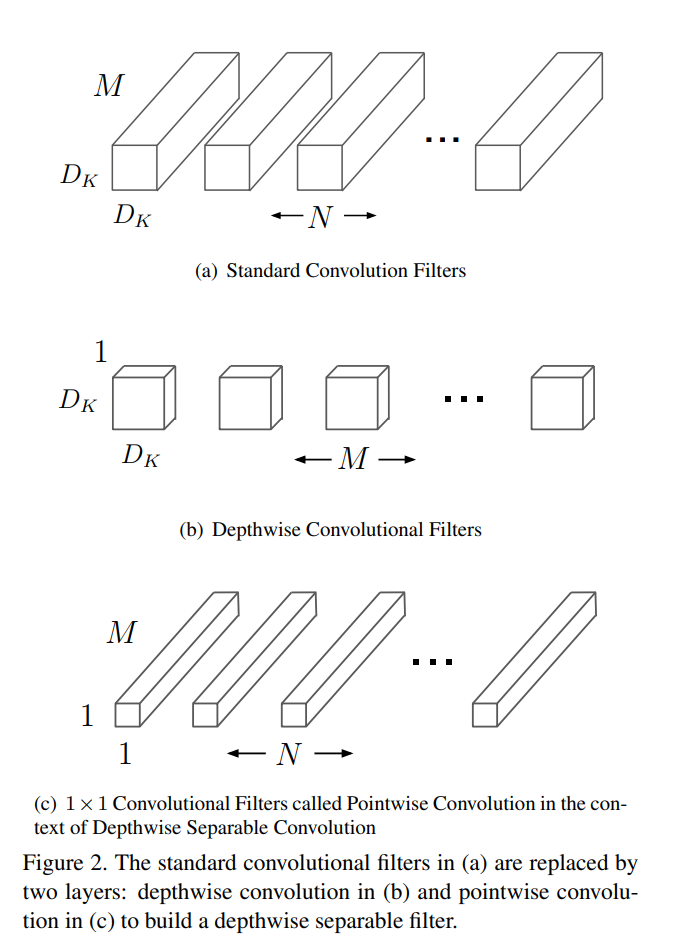
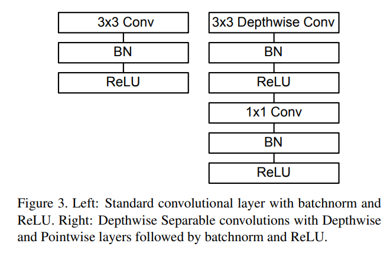
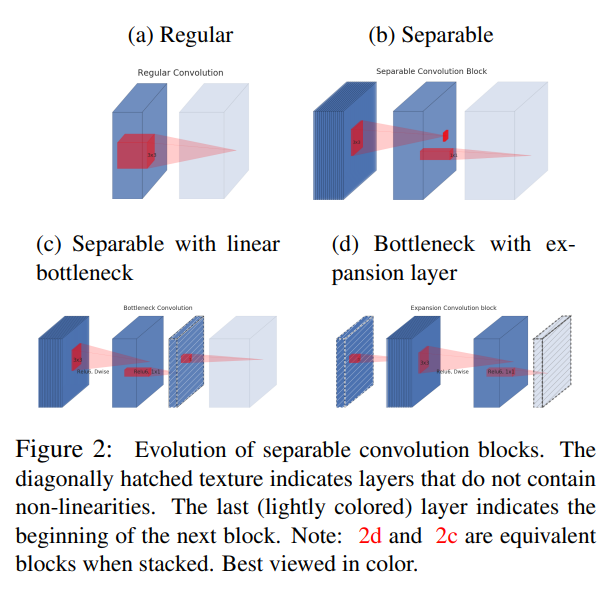
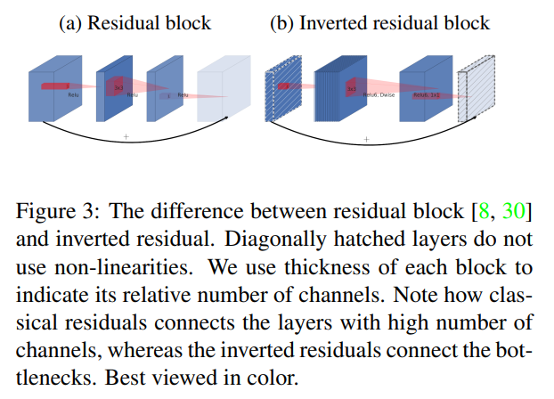
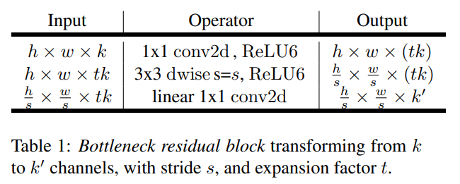
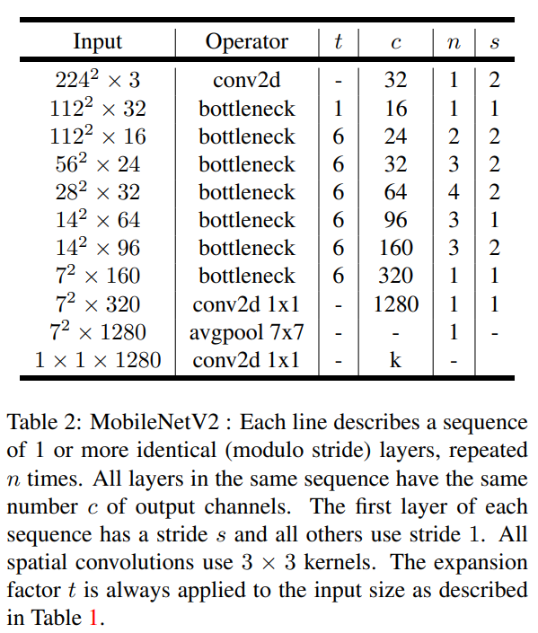

# CNN Study

Study and implementation of CNN architectures (LeNet, AlexNet, VGG, ResNet, MobileNet, EfficientNet) with PyTorch, along with structured experiments and performance comparisons.

## LeNet-5

- Paper: [Gradient-Based Learning Applied to Document Recognition](http://yann.lecun.com/exdb/publis/pdf/lecun-98.pdf)
- Authors: Yann LeCunn, Leon Bottou, Yoshua Bengio, and Patrick Haffner

- One of the earliest successful Convolutional Neural Network (CNN) architectures

- Motivation:
  - Fully connected networks are inefficient for image data (too many parameters)
  - Exploits spatial structure of images

- Key Ideas:
  - Local receptive fields
  - Weight sharing (reduces parameters)

- Significance:
  - Demonstrated strong performance on handwritten digit recognition (MNIST)
  - Foundation of modern CNN architectures

- Impelmentation: [cnn_study.models.lenet.LeNet5](./src/cnn_study/models/lenet.py)

  > The implementation is slightly adapted to a more modern architecture.
  > 
  > - S2 -> C3 feature map fully connected
  > - Trainable Pooling => Fixed Pooling
  > - tanh activation => ReLU activation
  > - Optional batch normalization

## AlexNet

- Paper: [ImageNet Classification with Deep Convolutional Neural Networks](https://proceedings.neurips.cc/paper_files/paper/2012/file/c399862d3b9d6b76c8436e924a68c45b-Paper.pdf)
- Authors: Alex Krizhevsky, Ilya Sutskever, and Geoffrey E. Hinton

- Winner of ILSVRC-2012 (ImageNet classification)
- Demonstrated that deep CNNs can achieve strong performance on large-scale datasets

- Key contributions:
  - ReLU activation (faster training than tanh/sigmoid)
  - Model parallelism across two GPUs (split network with limited cross-connections)
  - Local Response Normalization (LRN)
    - Normalizes across nearby feature channels
    - Encourages competition between neurons
  - Overlapping pooling (kernel size > stride)
  - Extensive data augmentation:
    - Random cropping / translation
    - Horizontal reflection
    - PCA-based RGB color augmentation
  - Dropout in fully connected layers to reduce overfitting

- Architectural characteristics:
  - Large convolution kernel and stride in early layers (11x11, stride 4)
  - Large fully connected layers (dominant parameter count)

- Implementation: [cnn_study.models.alexnet.AlexNet](./src/cnn_study/models/alexnet.py)
  > The implementation is slightly adapted to a more modern architecture.
  > 
  > - Full connected CNN connection(for single GPU)
  > - Remove LRN(instead use optional batch normalization)

## VGG

- Paper: [Very Deep Convolutional Networks for Large-Scale Image Recognition](https://arxiv.org/pdf/1409.1556)
- Authors: Karen Simonyan & Andrew Zisserman

- ILSVRC-2014 first and second places in localisation and classification trakcs respectively

- Demonstrated that increasing network depth improves classification performance

- Used a simple and uniform architecture:
  - 3×3 convolutions (stride=1, padding=1)
  - 2×2 max pooling

- Showed that stacking small convolutions is more effective than using large kernels:
  - Three 3×3 convolutions ≈ one 7×7 receptive field
  - Fewer parameters
  - More nonlinearities

- Explored 1×1 convolutions as additional nonlinear transformations

- Showed no improvement by using LRN introduced from AlexNet

- Introduced multi-scale training(kind of augmentation) and advanced test-time evaluation:
  - Dense evaluation
  - Multi-crop evaluation
  - Multi-crop & dense evaluation

- Large fully connected classifier remained a major portion of model parameters

- Later architectures (e.g. ResNet) addressed optimization difficulties when scaling to much deeper networks

- Implementation: [cnn_study.models.vgg.VGG16/VGG19](./src/cnn_study/models/vgg.py)

## ResNet

- Paper: [Deep Residual Learning for Image Recognition](https://arxiv.org/pdf/1512.03385)
- Authors: Kaiming He, Xiangyu Zhang, Shaoqing Ren, Jian Sun

- Winner of ILSVRC-2015 classification, detection, and localization tasks
- Winner of COCO-2015 detection and segmentation tasks

- Residual Learning 으로 Layer 가 깊어질 때 Optimization 이 어려워지는 degradation 문제 해결
  > **degradation**:
  >
  > 더 깊은 모델은 얕은 모델의 해를 포함할 수 있음.(추가된 layer가 identity mapping을 학습하면 되므로)
  >
  > 따라서 training error는 최소한 동일하거나 더 낮아야 하지만, 실제로는 깊어질수록 training error 자체가 증가하는 현상이 발생.
  >
  > => overfitting 이나 vanishing gradient 와는 다른 optimization difficulty 임.

  - 특정 레이어의 Output 에 Input 을 그대로(identity) element-wise addition 을 하는 Skip-connection 추가
  - `H(x) = F(x) + x` 에서, `H(x)` 를 학습하는 것보다 residual 인 `F(x)` 만 학습하는 것이 더 쉽다.
  (극단적으로 `H(x) = x` 를 찾아가야된다고할 때, `H(x) = x` 를 학습하는 것 보다 `F(x) = 0` 을 학습하는 것이 훨씬 쉽다.)
    > 입/출력 차원이 다를 때는 projection 을 추가(or zero padding)
    >
    > Shortcut options:
    > - A: Identity + zerro padding
    > - B: 차원이 늘때만 Projection shortcut(1x1 conv)
    > - C: 모든 shortcut connections 에 projection 추가

  - Bottleneck Block 사용
    - 더 깊은 ResNet-50, 101, 152 에서는 다음 변형 사용
      
    - 층을 늘리면서도 time complexity 유사

- 모든 Layer에 BatchNorm 적용

- Classifier 입력 전에 Global Average Pooling 사용(FC에서의 파라미터수 획기적 감소)

- Object Detection 에도 잘 동작 함
  - Faster R-CNN 에서 backbone 을 VGG => ResNet 으로 바꾸는 것만으로 큰 성능 향상을 보임

- Implementation: [cnn_study.models.resnet](./src/cnn_study/models/resnet.py)

## MobileNet

- Paper: [MobileNets: Efficient Convolutional Neural Networks for Mobile Vision Applications](https://arxiv.org/pdf/1704.04861)

- **Depthwise Separable Convolution** 구조를 기반으로 한 모바일/임베디드 환경을 위한
 효율적인 경량화 모델 구조 제안
  
  - 3x3 convolution 대신 channel 별(depthwise) 3x3 colvolution 과 1x1 convolution(pointwise) 으로 분리
  - 일종의 극단적인 factorized convolution
  - 3x3 depthwise convolution 에서는 filtering 만하고 pointwise 에서 channel 결합하여 새로운 feature 생성
  - 일반적인 3x3 convolution 대비 8-9배 적은 계산
  - 분리된 각각의 colvolution layer 뒤에 BN, ReLU 유닛
    
  - 첫 번째 층만 일반 3x3 convolution 사용하고, 마지막은 GAP 후 FC 사용

- Width multiplier, resolution multiplier hyper parameter 로 모델 크기 결정
  - **Width Multiplier**: 입출력 및 중간층의 채널 수를 결정(Thinner Models)
  - **Resolution Multiplier**: 입력 이미지의 크기(해상도) 조절(width/height)
  - 성능-연산량 trade-off 를 유연하게 조절 가능

- 획기적인 계산량 및 파리미터 수 감소 대비 비교적 경쟁력있는 성능을 보여줌
- ImageNet Classification, Object Detection, Geolocalization 등 다양한 task 에 대해서도 모델 크기/속도 대비 경쟁력 있는 성능을 보여줌
- Face Attribute Classification 실험에서 Distillation 학습을 적용하여 추가 정규화 없이도 높은 성능을 달성
  - Teacher 모델 대비 약 100배 이상의 계산량 절감과 유사한 정확도 달성

- Implementation: [cnn_study.models.mobilenet](./src/cnn_study/models/mobilenet.py)

## MobileNetV2

- Paper: [MobileNetV2: inverted Residuals and Linear Bottlenecks](https://arxiv.org/pdf/1801.04381)

- Inverted Residual with Linear Bottlneck

  
  - Linear Bottleneck
    - 보통 d 차원(채널)의 정보는 "manifold of interest"를 형성한다고 보고, 저차원의 subspace로 embeding이 가능하다고 봄.
    - ReLU의 경우 non-zero value에 대해서는 입/출력이 동일하므로 해당 영역에서는 linear transformation으로 볼 수 있음.
    - 저차원의 bottlneck layer의 경우 압축된 형태로 ReLU와 같은 non-linearity activation 이 추가되면 필수적인 정보가 사라질 수 있어 non-linear activation을 제외.
    - 저자의 실험에서도 bottleneck 층에 non-linear activation을 없앴을 때 약간의 정확도 향상을 확인
  - Inverted Residual

    
    
    - 기존 ResNet의 bottlneck 구조는 Input -> Bottleneck(저차원) -> Output(+ Input Identity) 
    - MobileNetV2 에서는 Input Bottleneck -> Expansion Layer ->  Output Bottleneck(+ Input Identity) 으로 Bottleneck이 input/output 이 되고, 그 중간에 큰 차원의 layer 를 둠.
    - Expansion Layer 는 1x1 convolution 으로 expansion ratio 만큼 차원을 늘린 뒤, 3x3 depth-wise convolution 후 다시 1x1 covolution 으로 출력 차원 수를 맞춤.
    - Residual connection 이 expansion layer 가 아닌 bottleneck layer를 연결.
    - 마지막 1x1 convolution 은 non-lineary activation을 사용하지 않는 linear transformation.
    - Bottleneck layer는 정보를 저장하는 capacity를 담당하고, expanded layer는 비선형 변환을 수행하는 expressiveness를 담당.
    - Inverted Residual 형태가 기존의 residual bottleneck 보다 추론시 메모리를 덜 쓰도록 최적화 가능.

- 첫 layer에 regular full convolution 후 이후에 bottleneck block을 반복적으로 사용하여 모델 구성.
  

  - 첫 bottleneck layer를 제외하곤 모두 expansion ratio 6 사용
  - 실험 결과 expansion ratio 5~10 구간에서는 유사한 성능을 보였으며, MobileNetV2는 정확도와 효율성의 균형을 고려하여 expansion ratio 6을 채택.

- v1과 동일하게 resolution multiplier 와 width multiplier 로 accuracy-performance trade off 조절
- v1과 달리 width multiplier < 1 인 경우에는 마지막 1280-channel convolution layer는 축소하지 않음.(width multiplier > 1인 경우에는 확장)

- Implementation: [cnn_study.models.mobilenet](./src/cnn_study/models/mobilenet.py)
  > 논문에서는 dropout 을 언급하지만 다른 구현과의 일관성을 위해 여기서는 생략함.