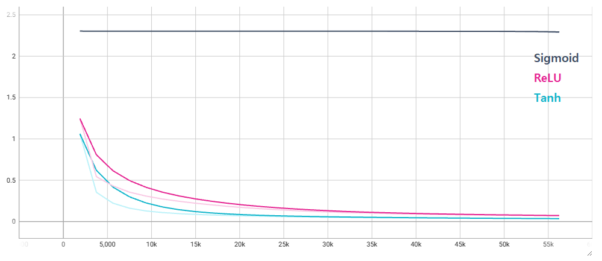
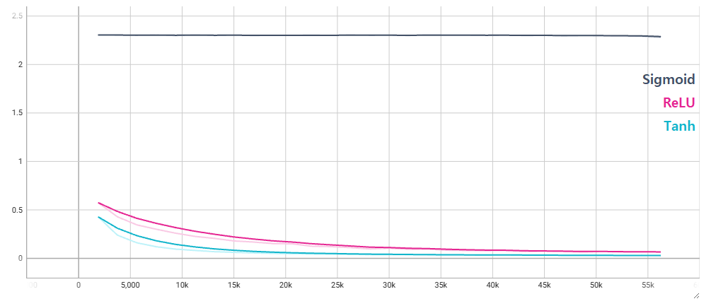
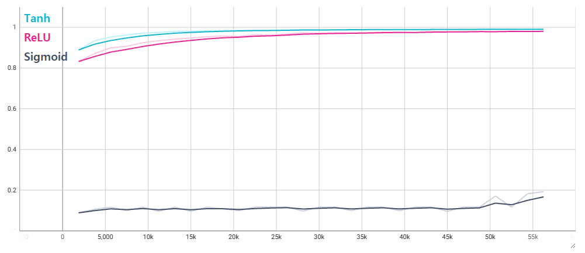
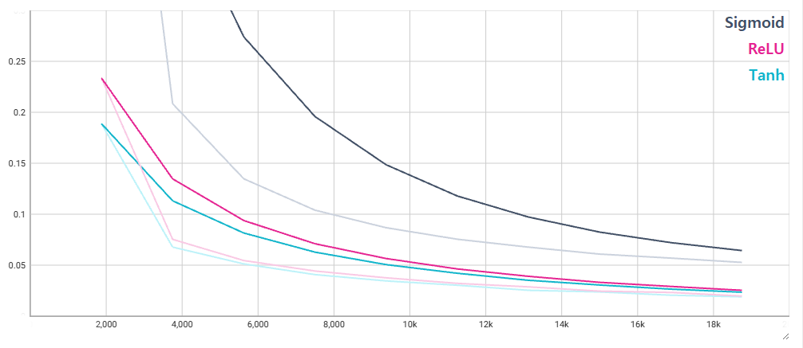
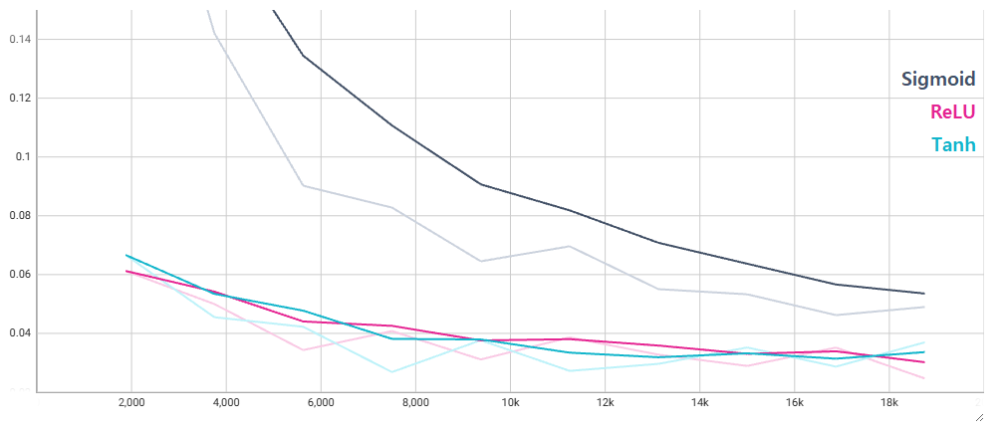
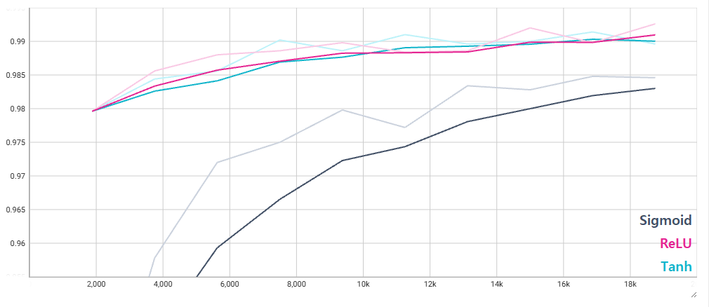

# LeNet-5 Activation Comparision

Compare 3 different activations(ReLU, sigmoid, tanh) for LeNet-5 with MNIST dataset.

## Experiment Environment

- OS: Ubuntu 24.04.4 LTS on Windows 10 x86_64
- Kernel: 5.15.153.1-microsoft-standard-WSL2
- CPU: 13th Gen Intel i9-13900H (20) @ 2.995GHz
- Memory: 2719MiB / 23898MiB
- GPU: NVIDIA GeForce RTX 4070 Laptop GPU
- Git Commit: 90d49b3df21b1ea3f6ddc2ff6fbeffd016564e4c

## Test Results

### Test 1(SGD)

|Activation|Best Accuracy|
|---|---|
|Sigmoid|19.26%|
|Tanh|99.12%|
|ReLU|98.14%|

- Optimizer: **SGD**
- Learning Rate: 0.01
- Batch Size: 32
- Epochs: 30

#### Train Loss



#### Validation Loss



#### Valdiation Accuracy



#### Commands

- **Sigmoid**

  ```bash
  uv run python scripts/train.py optimizer@lightning_module.optimizer=sgd model.activation=sigmoid experiment_name=lenet_sigmoid
  ```

- **Tanh**

  ```bash
  uv run python scripts/train.py optimizer@lightning_module.optimizer=sgd model.activation=tanh experiment_name=lenet_tanh
  ```

- **ReLU**

  ```bash
  uv run python scripts/train.py optimizer@lightning_module.optimizer=sgd model.activation=relu experiment_name=lenet_relu
  ```

### Test 2(AdamW)

|Activation|Best Accuracy|
|---|---|
|Sigmoid|98.48%|
|Tanh|99.14%|
|ReLU|99.26%|

- Optimizer: **AdamW**
- Learning Rate: 0.001
- Batch Size: 32
- Epochs: 10

#### Train Loss



#### Validation Loss



#### Valdiation Accuracy



#### Commands

- **Sigmoid**

  ```bash
  uv run python scripts/train.py trainer.max_epochs=10 model.activation=sigmoid experiment_name=lenet_adamw_sigmoid
  ```

- **Tanh**

  ```bash
  uv run python scripts/train.py trainer.max_epochs=10 model.activation=tanh experiment_name=lenet_adamw_tanh
  ```

- **ReLU**

  ```bash
  uv run python scripts/train.py trainer.max_epochs=10 model.activation=relu experiment_name=lenet_adamw_relu
  ```

## Conclusion


- Sigmoid significantly underperformed Tanh and ReLU when trained with SGD. In particular, the Sigmoid model failed to converge and achieved only 19.26% validation accuracy, indicating severe optimization difficulties.

- Tanh and ReLU achieved comparable performance on LeNet-5 with the MNIST dataset. Tanh slightly outperformed ReLU in the SGD experiment, while ReLU achieved the highest accuracy in the AdamW experiment. The small performance gap suggests that activation choice is less critical for shallow networks such as LeNet-5.

- The optimizer had a larger impact on performance than the activation function. Switching from SGD to AdamW dramatically improved convergence, especially for Sigmoid, whose validation accuracy increased from 19.26% to 98.48%.

- Overall, AdamW provided faster and more stable optimization across all activation functions. For this task, optimizer selection appeared to be more influential than the choice between Tanh and ReLU.

- Future experiments will evaluate the same activation functions on deeper architectures (e.g., VGG or ResNet) to investigate whether the advantages of ReLU become more pronounced as network depth increases.
